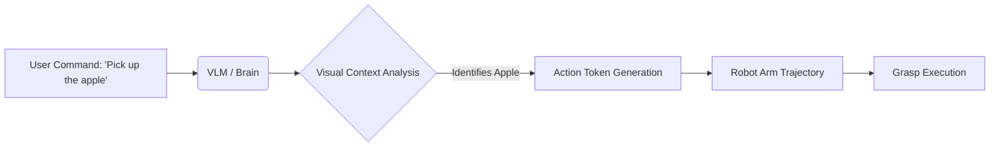

# Module 1: Foundations of Physical AI

:::tip **Learning Objective**
Understand the convergence of Large Language Models (LLMs), Computer Vision, and Control Theory that defines **Physical AI**.
:::

## 1.1 What is Physical AI?

**Physical AI** differs fundamentally from the "Generative AI" (like ChatGPT) you are used to. While GenAI processes text and images, Physical AI must process **Physics**.

*   **Embodiment:** The AI exists within a physical container (robot body).
*   **Interaction:** It must manipulate objects, not just describe them.
*   **Consequences:** Errors in Physical AI lead to crashes, breakage, or injury, unlike text errors.

### The "Moravec's Paradox"
> *It is comparatively easy to make computers exhibit adult level performance on intelligence tests or playing checkers, and difficult or impossible to give them the skills of a one-year-old when it comes to perception and mobility.*

## 1.2 The Rise of Humanoids

Humanoid robots have transitioned from rigid, pre-programmed machines (like the early Honda ASIMO) to adaptive, learning-based agents.

| Feature | Traditional Robots | AI-Native Humanoids |
| :--- | :--- | :--- |
| **Control** | Hard-coded Trajectories | Neural Networks (End-to-End) |
| **Vision** | Lidar / Depth Maps | Vision-Language Models (VLM) |
| **Adaptability** | Fails in new environments | Generalizes to new tasks |
| **Example** | Boston Dynamics Atlas (Old) | Tesla Optimus / Figure 01 |

## 1.3 Core Components of a Humanoid

To build a humanoid, we need three distinct stacks working in unison:

1.  **The Body (Actuation):**
    *   BLDC Motors with high torque density.
    *   Harmonic Drives for precision gearing.
    *   Battery systems with high discharge rates.

2.  **The Brain (Compute):**
    *   **High-Level:** Planning and Reasoning (e.g., "Make me a sandwich").
    *   **Mid-Level:** Trajectory generation and pathfinding.
    *   **Low-Level:** Real-time joint control (1000Hz loop).

3.  **The Senses (Perception):**
    *   **Proprioception:** IMUs (balance) and Encoders (joint position).
    *   **Exteroception:** Cameras (RGB-D) and Tactile Sensors (skin).

## 1.4 Case Study: The VLA (Vision-Language-Action) Model

Modern Physical AI uses **VLA Models**. These are models trained not just on text (internet data) but on robot trajectories.

*   **Input:** "Pick up the red apple."
*   **Processing:** The model sees the image, locates the apple, and outputs motor commands directly.
*   **Output:** 7-DOF arm movement.

## Summary

In this module, we established that Physical AI is the next frontier. It requires a shift from pure software thinking to **Systems Thinking**—where code meets metal.

**Next Step:** How do these components talk to each other? Enter **ROS 2**.
