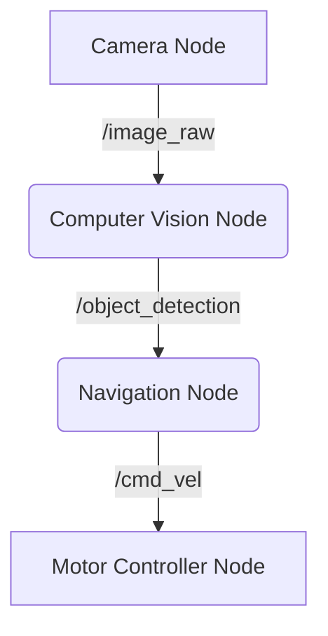

# Module 2: The Nervous System (ROS 2)

:::info **Prerequisite**
Ensure you have a basic understanding of Python classes and asynchronous programming before diving deep into this module.
:::

## 2.1 Why ROS 2?

The **Robot Operating System (ROS)** is not an OS in the traditional sense (like Windows or Linux). It is a **Middleware**—a plumbing system that allows different parts of a robot to communicate.

**ROS 1 vs. ROS 2:**
*   **ROS 1:** Relied on a central "Master". If the Master crashed, the robot died. Not real-time safe.
*   **ROS 2:** Distributed architecture based on **DDS (Data Distribution Service)**. No central point of failure. Real-time capable.

## 2.2 The Graph Architecture

Imagine a robot as a graph of connected processes.

*   **Nodes:** The "Neurons". Each node performs one specific task (e.g., `CameraDriver`, `WheelController`, `PathPlanner`).
*   **Topics:** The "Axons". Channels where data flows continuously (e.g., `sensor_data`, `motor_commands`).
*   **Services:** The "Request/Reply" mechanism. (e.g., "Reset Odometry").

### Visualizing the Graph



1.  **Camera Node** publishes raw images.
2.  **CV Node** subscribes to images, detects obstacles, and publishes coordinates.
3.  **Nav Node** decides where to move and publishes velocity commands.
4.  **Motor Node** spins the wheels.

## 2.3 Implementation: Writing a Node

Here is a professional-grade Python implementation of a ROS 2 Node.

```python
import rclpy
from rclpy.node import Node
from std_msgs.msg import String

class ProfessionalTalker(Node):
    def __init__(self):
        super().__init__('minimal_publisher')
        # Create a publisher on topic 'topic' with queue size 10
        self.publisher_ = self.create_publisher(String, 'topic', 10)
        timer_period = 0.5  # seconds
        self.timer = self.create_timer(timer_period, self.timer_callback)
        self.i = 0

    def timer_callback(self):
        msg = String()
        msg.data = f'Hello World: {self.i}'
        self.publisher_.publish(msg)
        self.get_logger().info(f'Publishing: "{msg.data}"')
        self.i += 1

def main(args=None):
    rclpy.init(args=args)
    minimal_publisher = ProfessionalTalker()
    rclpy.spin(minimal_publisher)
    # Destroy the node explicitly
    minimal_publisher.destroy_node()
    rclpy.shutdown()

if __name__ == '__main__':
    main()
```

## 2.4 DDS (Data Distribution Service)

ROS 2 sits on top of DDS. DDS handles the heavy lifting of networking.

*   **Discovery:** Nodes automatically find each other on the network.
*   **QoS (Quality of Service):** You can tune connections.
    *   *Reliable:* TCP-like. Guarantees delivery (Good for parameters).
    *   *Best Effort:* UDP-like. Fast, drop packets if needed (Good for video streams).

## Summary

ROS 2 provides the standard interfaces (Messages, Topics, Services) that allow a camera from Manufacturer A to talk to a motor from Manufacturer B without rewriting code. It is the industry standard for robotics.
